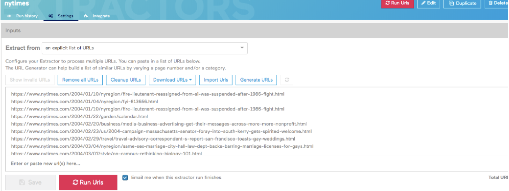
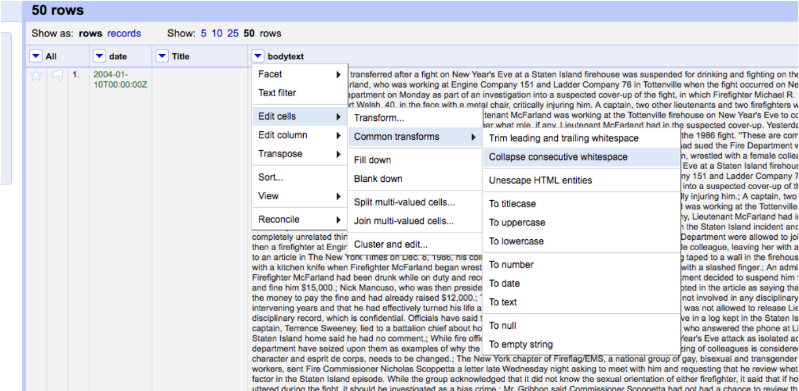
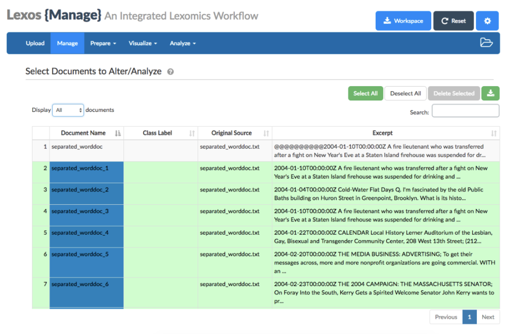

# Scrape Web Pages with Import-io

Import-io is a point and click tool that you can use to collect content from websites. If you want to collect the same kind of content, like multiple articles from the New York Times, Import-io can grab all of that content at once by using a batch upload option. You will need to sign up for a free 7 day trial, so you’ll need to wait to sign up until you’re ready to gather your data. Here’s how to use Import-io:

## Create an “extractor” or train Import-io to grab the content you need:

1. Open a browser to https://app.import.io/dash. Import.io has a variety of extractors that you can train. Create a new extractor and paste in one URL from your collection.
1. Train your extractor by clicking on “new column” and dragging the content you’d like within the green box that will appear. You can continue to grab the content as you need -- you don’t need to grab it in one swoop. 
1. Click on a “new column” when you want to add text that you’d like to separate out. So, if you’d like the article body separate from the author, you’ll want to create separate columns for “article body” and for “author.” 
1. Save your extracter as a name you’ll recognize in the future. Once you’ve saved your extractor, it should appear within the right hand side of your browser. 
1. Upload a list of URLs with similar content that you want to grab:
    * Create a CSV or Excel XLSX file of URLs that you want to grab. 
    * Click the extractor you made based on one URL and click “settings” on the page.
    * Click “extract from an explicit list of URLs” and upload your CSV or Excel XLSX file of urls. 
    
    
    
    * Click “run URLs” to have the extractor crawl through every URL in the same way you originally trained it.
    * Download the data as a .xlsx file.
    
    
    
    * Open your spreadsheet
    
    

How does it look? Do you need to clean your data? 
If you’re using your files for text mining, it can be helpful to have your data in plain text files rather than a spreadsheet, and have each text in individual files like the Documenting the South dataset from University of North Carolina.

## Clean your data

Use OpenRefine to make any adjustments to your data. You might, for example, want to convert the dates to UTC format and to check columns for whitespace.
Open the OpenRefine interface:

* On a Windows machine: Open the “C:/openrefine-win-2.6-rc2/openrefine-2.6-rc2” folder in your system and run “openrefine.exe” by clicking on the named file twice to open the OpenRefine interface at the address 127.0.0.1:3333 (you can always navigate back to the OpenRefine interface by pointing your browser to this address, and can even use it in multiple windows using it).
* On a Mac: Open OpenRefine in Applications. It will open up a tab in your web browser. 

1. Once you are in the OpenRefine interface, click “Create Project” and upload the spreadsheet you recently finished editing. Click "Next" and then Create Project" again.
1. Pubdate: We can change the pubdates to UTC format (e.g., 2016-01-01T00:00:00Z).
To change this, mouse over the arrow at the top of the pubdate column. 
Select Edit Cells > Common transforms > To date. This should change all of the dates in the column to UTC format.   
1. Make sure there is no whitespace in any of your columns:
Open that column's drop down menu, and select "Edit Cells" > "Common transformations" > "trim leading and trailing whitespace”. 
Within the “article body” column, select “Edit Cells” > “Common transformations” > “Collapse consecutive whitespace”
1. Export your cleaned data as a .xls document. 

## Separate the texts into individual plain text files for text analysis 

1. Open a Word document that you will name, and paste (unformated) in the contents of the columns you exported from open refine. This will create a file with all the articles (beginning with date, author, title preceding the article body or whatever column order you’re using). Individual articles are separated from each other by a return (the only use of returns in the file).  
1. Using Word's find-and-replace function, replace all returns (found by searching for "^13") with three spaces, followed by ten "@" signs, followed by two returns ("   ^13^13@@@@@@@@@@").  This creates an easy-to-recognize and -manipulate delimiter between individual articles in the aggregate file. 
1. Finally, save or export the.docx Word file as a .txt file (e.g., save as “aggregate-plain-txt”) as follows: 
When Word shows the dialogue for conversion to plain text, choose "other encoding" > "Unicode UTF8" (i.e., do not choose "Windows default").
1. There are a number of tools to chop one file into multiple files using a specific delimiter. In our case, our delimiter is the ten "@" signs (@@@@@@@@@@) between each of our articles. 
You can use [Lexos](http://lexos.wheatoncollege.edu/upload) to cut your plain text file at the delimiter (@@@@@@@@@@), and then download the cut files into individual plain text documents. The value of this is that you can now explore the corpus you’ve created down to the document level. 

1. Finally, check the folder icon at the top of the Lexos page. Do you see your files? Download your files. You should now have a folder with individual plain text files of each document. 

